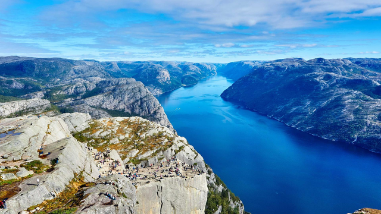
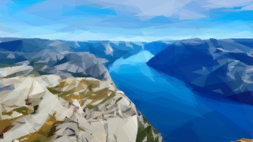
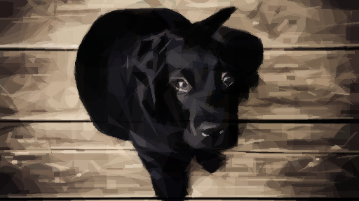
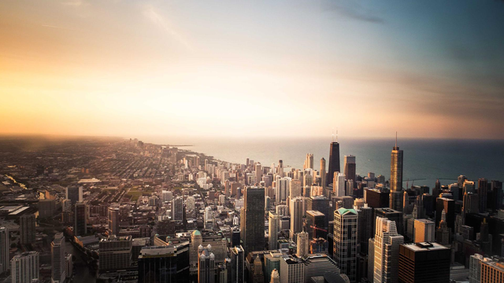
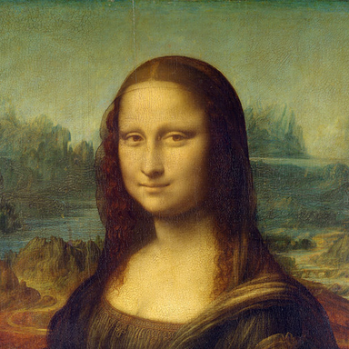
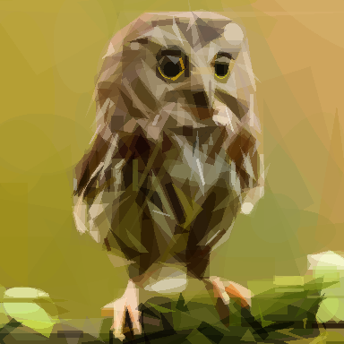
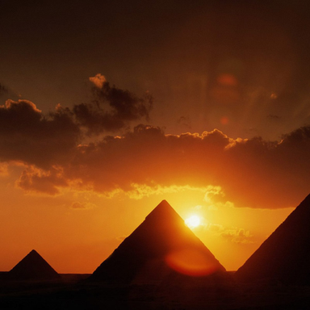

# Shardset

Rebuild any image out of a few hundred overlapping geometric shards: triangles,
rectangles, ellipses, circles, Bezier strokes, polygons. You pick the shape and
how many; Shardset greedily searches for the shard that best reduces the
difference from the target, over and over, until a recognizable low-poly version
of your image emerges.

**Python-driven, Rust-powered.** Python handles the CLI, the GUI and image I/O;
the optimization loop (the slow part) runs in a compiled multicore Rust engine
across every CPU core, so a full run finishes in seconds, not minutes.

- GUI and CLI, same engine.
- 9 shape modes (incl. a combo mode that mixes all of them).
- Export to PNG (raster) or SVG (resolution-independent vector).
- Live "watch it build" animation in the GUI.

## Credits / prior art

Shardset is a derivative of two ideas:

- **Roger Johansson, "Genetic Programming: Evolution of Mona Lisa" (2008)** which
  first popularized reconstructing an image from a handful of semi-transparent
  polygons: https://rogerjohansson.blog/2008/12/07/genetic-programming-evolution-of-mona-lisa/
- **Michael Fogleman's `primitive`** (Go), the well-known hill-climbing take on
  the same idea: https://github.com/fogleman/primitive

Shardset reimplements that idea from scratch in Rust + Python, with a multicore
engine, a desktop GUI and a CLI. The algorithm and credit for the original
concept belong to the authors above.

## Install

Prerequisites: **Python 3.9+**, the **Rust toolchain** (https://rustup.rs), and
**maturin** (to compile the Rust engine into a Python module).

```bash
# 1. create and activate a virtual environment
python -m venv .venv
.venv\Scripts\activate        # Windows
# source .venv/bin/activate   # macOS / Linux

# 2. install Python deps
pip install maturin flet pillow

# 3. build the Rust engine and install it into the venv
cd rust
maturin develop --release
cd ..
```

That compiles `shardset_engine` (the Rust core) and installs it into your active
environment.

> **Zero-setup shortcut:** `cli.py` and `gui.py` self-bootstrap. On first run they
> auto-install any missing dependency (`pillow`, `flet`, and the Rust engine from
> the prebuilt wheel) into the current interpreter, so in practice you can often
> skip straight to the Run section. Building the engine from source still needs the
> Rust toolchain if no wheel is present.

## Run

### GUI

```bash
python python/gui.py
```

Load an image, pick a shape and a shard count, hit **Run**, and watch it build.
Save the result as PNG or SVG.

### CLI

```bash
python python/cli.py -i input.jpg -o out.png -o out.svg -n 200 -m 1
```

| flag | meaning | default |
|------|---------|---------|
| `-i` | input image | required |
| `-o` | output path (`.png` or `.svg`); repeatable | required |
| `-n` | number of shards | required |
| `-m` | shape mode (see below) | 1 |
| `-a` | alpha 0-255 (0 = auto) | 128 |
| `-r` | resize input to this many px on the long edge | 256 |
| `-rep` | extra refined shards per step | 0 |
| `-j` | worker threads (0 = all cores) | 0 |
| `-bg` | background hex color | auto |

Shape modes: `0` combo (all) · `1` triangle · `2` rectangle · `3` ellipse ·
`4` circle · `5` rotated rectangle · `6` Bezier · `7` rotated ellipse · `8` polygon.

## Samples

Every reconstruction below was produced by Shardset and also exported as `.svg`.
Times are the engine's own render time, all CPU cores (measured on a 32-core
machine); your mileage scales with core count and `-r` size.

### Full HD photos

1920x1080 source photos, downscaled to 512&nbsp;px for fitting.

| Original | Shardset | Recipe | Time |
|:--------:|:--------:|--------|:----:|
|  |  | 500 triangles `-m 1 -n 500 -r 512` | **9.8 s** |
|  |  | 600 combo shapes `-m 0 -n 600 -r 512` | **12.7 s** |
|  |  | 700 triangles `-m 1 -n 700 -r 512` | **14.3 s** |

### Classic test images

| Original | Shardset | Recipe |
|:--------:|:--------:|--------|
|  |  | 250 triangles &nbsp; `-m 1 -n 250` |
|  |  | 300 combo shapes &nbsp; `-m 0 -n 300` |
|  |  | 200 rotated rectangles &nbsp; `-m 5 -n 200` |

## How it works

1. Start from a solid background (the average color of the target).
2. Each step, many worker threads independently propose random shards and
   hill-climb them (mutate position/size/shape) to find one that lowers the
   root-mean-square difference from the target.
3. The best shard found that step is drawn in permanently.
4. Repeat for N steps. More shards = closer to the original.

Score is RMSE (0 = identical). It only ever goes down.

## License

Shardset is released under the **MIT License** (see [`LICENSE`](LICENSE)),
Copyright (c) 2026 Nikhil Singh. The underlying concept is credited to Roger
Johansson and Michael Fogleman (see Credits above); `primitive` is MIT-licensed
too, so this reimplementation is free to share under the same terms.
